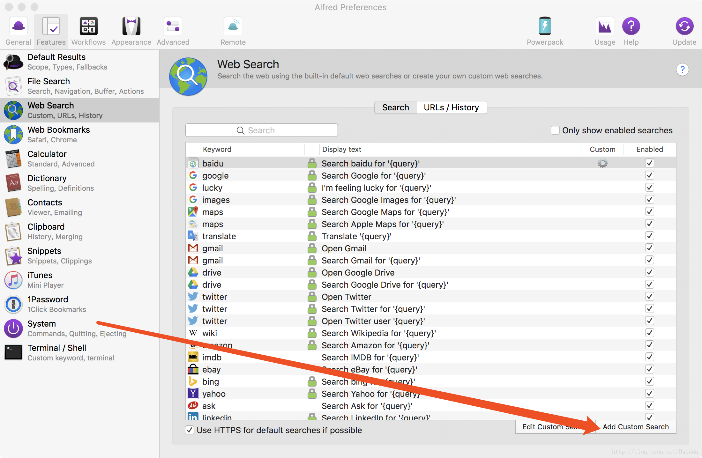

# 安装

# 快捷键

唤起  `option+空格`
设置  `command+,`

# 配置百度搜索
在配置页找到`Web Search` 点击右下角`Edit custom Search`. 在弹出框里配置

```
Search URL: https://www.baidu.com/s?wd={query}
Title: 百度(随便写)
keyWord: b(这个要记住)
```
点save

唤醒后再输入框输入`b (任意字符)` 会自动打开百度搜索

完成上述步骤后， 再点击"Features"->Default Results->"Setup fallback results"->点击弹出的窗口右下角"+"号->选择Custom Rearch 下的百度(上一步设置的Title)，操作步骤如下图。


[记忆曲线](Alfred/add baidu.png)

