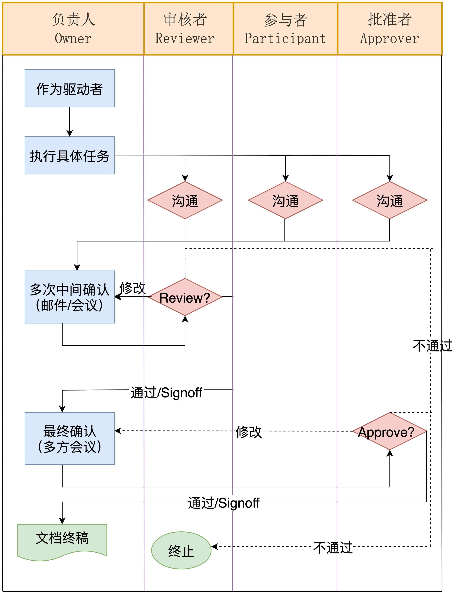
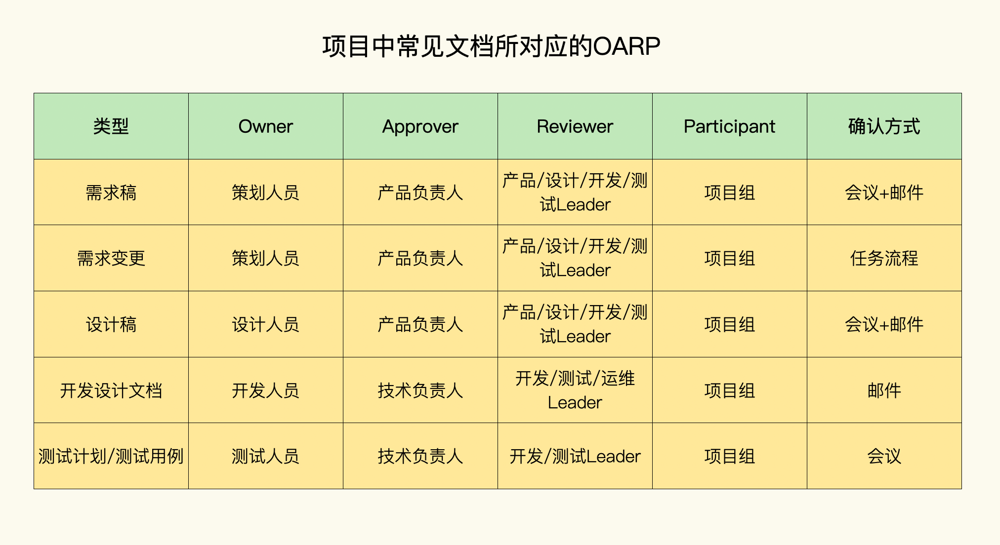

今天我要跟你分享的主题是：打造品质，要从头开始闭环。在正式开讲之前，我想先和你分享一个小故事。

### `学习场景：这……不是我想要的！`

这天，我在公司走廊上碰到了面如死灰的艾文。

蓓蓓：怎么感觉你今天双眼无神，发生什么事了？

艾文：太惨了。我们团队一个多月没日没夜，可算是在618来临前，完成了购物节活动的所有功能，全部测试完毕，马上就要上线了。结果，刚刚产品负责人试用之后，皱着眉头说：这……不是我想要的！你说，还有比我更惨的吗？他们早干吗去了呢？！

蓓蓓：是啊，为什么总是要最后做完了，才发现不是自己想要的呢？其实，这种现象并不少见，有些产品经理还美其名曰允许试错。但试错到最后，就发现付出的成本太高了。那么今天，我就来和你聊聊执行这件事，帮助你解决这个问题。

之所以会出现这种情况，有很多潜在的原因。比如，在互联网环境下，要弄清楚开发什么产品，准确把握并实现用户需求，对产品人员的要求其实非常高。对于互联网产品而言，从最初的一个想法，到确定规模化的增长模式，通常要经历很多轮的螺旋式迭代，不断调整。

除了这个原因之外，更为常见的情况是，需求和设计根本没有经过严格的把关，就匆忙投入开发；同时，在传统的研发中间过程中，很难看到串连起来的功能效果，产品经理必须等到快上线了，才能看到和真实体验到可完整运行的产品。但是这个时候，再想大幅修改产品，代价已经非常高了。

很多时候，我们确实没有办法一步到位，但合理试错，减少不必要的浪费，仍然是可以做到的。在项目执行的过程中，想要降低偏差、减少返工，`你就需要构建系统能力，在产品研发的整个过程中，建立起真正闭环反馈的产品验证机制`。

说到这里，我想先提一下，到底什么才是真正的闭环。我是学控制工程出身的，大学教科书里的一张展示开环和闭环系统的经典图片让我印象非常深刻。看了这张图，你就会明白，其实，`开环与闭环之间的关键差异，就在于有没有反馈环节，以及系统是否会根据反馈自动调节`。

那么，既然闭环如此重要，在产品研发的整个过程中，到底有哪些实用的闭环验证方法呢？我来给你介绍三种最实用的方法。

### `方案评审（OARP决策机制）`

其实，需求评审、交互评审、视觉评审都是非常基本的闭环验证方法。我在留言区了解到，有些项目是从来不做需求评审和设计评审的，产品人员找某位开发单方面讨论一下，需求就算定下来了，可以直接往下走了，这就是典型的开环系统。

还记得我在刚开始举的618购物节的例子吗？那次返工，不仅让团队一个多月的辛苦打了水漂，还错过了最黄金的购物节时间。不得不说，这样的开环系统，在上线后出现偏差是很正常的，因为在这个过程中，根本没有任何矫正的机会。

`要想执行中不走样，你就必须把方案评审做到位`。而一说到评审，很多人会说，不就是组织一个会吗？大家就是坐在一起看一看，流于形式。No！你需要理解的是，`评审的精髓不在会，而在于背后的决策机制`。只有决策机制清晰，职责分工明确，方案评审才会有好的闭环效果。这里我来给你介绍一个典型的决策机制，叫作OARP。

OARP是Owner、Approver、Reviewer、Participant的缩写，分别对应四个关键角色：

* 负责人（Owner）：负责给出方案，组织各方讨论并推进做出最终的决定；

* 批准者 （Approver)：最终批准者；

* 审核者（Reviewer）：负责人和批准者挑选出的审核人。审核者有责任对文档进行讨论分析，并提出反馈意见，负责人必须重视并给予回复；

* 参与者 （Participant）：其他提供意见的人。参与者会收到文档的相关信息，可以对相关问题做出反馈。

这张流程图清晰地展示了一个典型的方案评审流程。OARP是一套决策机制，你需要为项目中每一类方案的评审，确定明确的角色和职责，让各角色应享有的权利、应履行的职责，都得到规则上的保障，这样才能更好地确保方案质量，把后期的返工降到最低。

我给你总结了一份项目中常见文档所对应的OARP角色，你可以参考一下。

### `Bug Bash``（Bug大扫除）`

Bug Bash，也叫Bug大扫除，最初来自微软，是指在项目开发里程碑的末期（比如Beta版发布前），划出一个专门的时间段，在这期间，所有参与项目的人员，集中全部精力一起来给项目找Bug，目的是从各个维度衡量和体验产品。

这是一个非常有意思的活动，在网易也很受欢迎，在反复的实战应用中，我们对Bug Bash做了很多的改良，产生了很多有趣的变种。除了应用于测试阶段，我们还发现，Bug Bash是进行产品闭环验证的一个非常有效的方法。通常，在版本的需求稿和交互稿完成之后，我会专门安排一段时间，组织团队成员一起，集中精力给需求稿和设计稿找问题。

记得我第一次组织这样的活动时，程序员们开心坏了！因为，他们终于可以让策划和设计们，也尝尝修Bug的滋味了！曾经，在一次活动的需求设计Bug Bash上，运营同学发现了现有产品的逻辑错误，避免了上线后优惠券发放的漏洞，为我们提前规避了很大的损失。通过这些Bug Bash活动，我们把产品验证环节大大地提前了,不仅达到了更好的体验效果，还有效地保障了上线质量。

那么，想要组织一场Bug Bash活动，该从哪些方面着手呢？

NaN.  时间：测试类的Bug Bash，你可以选择在全面功能测试结束后，Bug趋于收敛的时间段开展；需求设计类的Bug Bash，一般会放在需求或设计稿完成后举行。这个活动需要一到两个小时的时间，你一定要提前排除所有干扰；

NaN.  地点：你需要设立一个单独的作战室，鼓励参与者自带笔记本，让他们尽可能集中精力做这一件事。同时，作战室可以提供一些零食和饮料，让活动更有氛围；

NaN.  参与者：除了研发和测试，产品、设计、市场、运营、销售等项目组不同角色的人群，都需要参与到这场活动中，这样你就可以获得更加丰富多维的视角；

NaN.  现场安排：你可以把现场反馈的问题直接贴在白板上，或者通过电子白板，来滚动更新Bug或建议的排名情况。需要注意的是，营造互动的氛围非常关键，如果因为空间受限，参与者做不到在同一地点进行，你至少也要在通信群中实时更新排名情况的变化。

NaN.  活动结束：在活动结束后，要直接公示Bug或建议数，现场给奖品，并发邮件通报全组。最后，在对Bug进行去重后，还要分类定级，确定哪些是必须修，哪些是改了会更好。另外，千万不要忘记公示结果，明确修复计划。

关于活动的组织方式，你可以加入更多游戏化的玩法，这些都是为了最大程度地调动团队成员的参与热情，让问题在早期得到更好地暴露。你可以在一些重要版本中尝试这样的方法，与很多低效冗长的评审会相比，这个活动在避免返工方面，会有非常好的实战效果。

实际上，有时候，视觉稿我们也会拿出来这么做。曾经，某个已经运营了三四年的重量级产品，要在一个月之内完成全网视觉改版，工作量巨大到难以想象，寻常做法很容易出问题，影响最终的用户体验。但时间非常紧张，我们根本来不及全部定稿，就必须开始并行开发，怎么办呢？

当时我就想到了Bug Bash，不过这回不是做一次，而是每天都做！我们把计划拆分到按天交付的颗粒度，每天晚饭后半个小时，大家会聚在一起，给刚刚做好的视觉稿找Bug。开发和测试人员的早期参与，让很多遗漏的视觉问题在早期就得以发现，避免了后期的很多返工。后来，这个视觉改版非常顺利地上线了！

让我没想到的是，在项目组的回顾会上，每天晚上的Bug Bash活动，竟然高票当选成为了最受欢迎的团队活动。仔细想想，Bug Bash也是非常好的团建活动，我至今都很怀念那段虽然无比辛苦，但有吃有喝、充满欢笑的革命岁月。

### `冒烟用例评审`

有同学留言问我说，当项目成员说完成了某个模块的工作时，项目管理人员怎么知道100%完成了呢？其实，项目经理最怕听到的一个词，就是差不多，比如，差不多写完了，差不多测好了，差不多可以发布了……每项工作都是差不多，可是一到测试环节，就会发现，其实还差得很远呢。

在上一讲中，我提到，做计划时要明确定义完成标准，而冒烟测试用例，可以说是开发和测试之间最基础的合约。

虽然冒烟测试这个概念很普遍，但是很多团队只是把它作为提测后的测试用例组，并没有真正发挥其合约的作用。要想避免掉进差不多的陷阱，在进入开发环节后，你需要安排专门的测试用例评审，让开发和测试对标准冒烟用例集达成约定，这个约定就会成为进入测试的准入标准。

开发发起提测以后，测试人员就会依照这个标准用例集进行冒烟，并记录冒烟测试通过率，如果通过率不达标，就打回修正并再次提测。

如果你是在完全没有基础的团队中推行这个做法，可以先从测试人员记录冒烟测试通过率开始。接着，你要收集相关数据，和你的团队在回顾会上一起看看冒烟用例失败所导致的后期返工成本，讨论出一种更好的确保质量的做法。在我直接管理的项目中，冒烟通过率的要求通常是100%，你可以选择从一个合适的起点开始，比如80%，然后再一步步逼近更好的提测质量。

### `总结`

总结一下，今天，我给你介绍了在项目执行过程中，有效降低偏差、避免返工的三种闭环验证方法，包括方案评审及OARP决策机制，Bug Bash（Bug大扫除）、以及冒烟测试用例评审。

其实说到底，这些方法都是为了保证执行过程不走样。需要注意的是，你并不需要在每一个版本中，把这些方法全都用上。你可以结合自己的项目情况，有步骤地开展优化，在核心的输出环节，设置合适的断点和关口，这样就能更好地把控全局了！

### `畅所欲言`

这一讲中，我跟你分享的，都是我们自己在实战中积累下来的闭环验证方法。只有到了执行时，你才会发现，理想有多丰满，现实就有多骨感。我想请你来聊一聊，你在项目执行过程中踩过的最痛的坑。如果你可以再分享一些你的爬坑指南，那就更好了。

欢迎你畅所欲言，我在留言区等你，也欢迎你把文章分享给你的朋友。

>